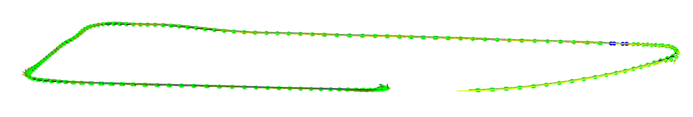

## Arduino INS  (Inertial Navigation System)

This project implements a lightweight, real-time Inertial Navigation System (INS) using Arduino-compatible hardware. Designed for embedded motion tracking, the system fuses data from IMU sensors to estimate position, velocity, and orientation without relying on external signals like GPS.

## Our Project Description

**Project Title: FitPal — The AI Fitness Plush Companion**

**Overview**
*FitPal* is a smart, AI-powered plush toy designed to be a cheerful fitness companion. Blending emotional interaction with fitness tracking, FitPal motivates users—especially children and casual exercisers—to stay active and engaged through playful conversation and real-time encouragement.

**Key Features**

* **AI Voice Interaction**: Engages in natural, supportive conversation tailored to the user’s activity level and mood.
* **Motion Detection**: Built-in sensors detect physical activities like walking, running, or cycling.
* **Real-Time Reactions**: FitPal cheers, encourages, or reacts with emotion based on user movement and exercise consistency.
* **Activity Tracking**: Tracks running and cycling routes using GPS or connected mobile devices, creating a personalized fitness log.
* **Emotionally Intelligent**: Uses speech patterns and motion feedback to assess user mood and respond empathetically.
* **Portable and Safe Design**: Soft, huggable, and durable – perfect for both home and outdoor use.

**Use Cases**

* Encouraging kids to develop healthy exercise habits in a fun, interactive way.
* Providing emotional motivation for solo exercisers during runs, walks, or cycling.
* Acting as a gentle companion for rehabilitation or low-intensity fitness routines.

**Vision**
We aim to create a new kind of fitness experience—one that’s emotionally rewarding, playfully interactive, and inclusive for users of all ages. FitPal transforms fitness from a task into a joyful adventure with a friend by your side.

**Slogan**
*“Move with Joy. Train with a Friend.”*
